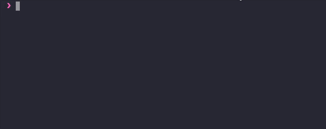
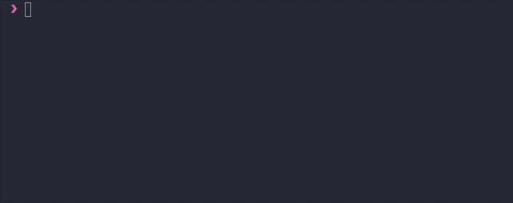

Share, download, and backup files with the command line! Automatically sync changes to datasets. Never worry about manually transferring files again.

Have questions or need some guidance?
You can chat with us on [Gitter][gitter-chat]!

## Getting Started

Dat's unique design works wherever you store your data. You can create a new dat from any folder on your computer.

A dat is some files from your computer and a `.dat` folder. Each dat has a unique `dat://` link. With your dat link, other users can download your files and live sync any updates.

### Sharing Data

You can start sharing your files with a single command. Unlike `git`, you do not have to initialize a repository first, `dat share` will do that for you:

```
dat share <dir>
```

Use `dat share` to create a dat and sync your files from your computer to other users. Dat scans your files inside `<dir>`, creating metadata in `<dir>/.dat`. Dat stores the public link, version history, and file information inside the dat folder.



### Downloading Data

```
dat clone dat://<link> <download-dir>
```

Use `dat clone` to download files from a remote computer sharing files with Dat. This will download the files from `dat://<link>` to your `<download-dir>`. The download exits after it completes but you can continue to update the files later after the clone is done. Use `dat pull` to update new files or `dat sync` to live sync changes.



Try out `dat clone` with the link above to read more about the protocol!

### Other Useful Commands

A few other highlights. Run `dat help` to see the full usage guide.

* `dat create` - Create an empty dat and `dat.json` file.
* `dat doctor` - Dat network doctor! The doctor tries to connect to a public peer. The doctor also creates a key to test direct connections.
* `dat log ~/data/dat-folder/` or `dat log dat://<key>` - view the history and metadata information for a dat.

### Quick Demos

To get started using Dat, you can try downloading a dat and then sharing a dat of your own.

#### Download Demo

We made a demo folder just for this exercise. Inside the demo folder is a `dat.json` file and a gif. We shared these files via Dat and now you can download them with our dat key!

Similar to git, you can download somebody's dat by running `dat clone <link>`. You can also specify the directory:

```
❯ dat clone dat://778f8d955175c92e4ced5e4f5563f69bfec0c86cc6f670352c457943666fe639 ~/Downloads/dat-demo
dat v13.5.0
Created new dat in /Users/joe/Downloads/dat-demo/.dat
Cloning: 2 files (1.4 MB)

2 connections | Download 614 KB/s Upload 0 B/s

dat sync complete.
Version 4
```

This will download our demo files to the `~/Downloads/dat-demo` folder. These files are being shared by a server over Dat (to ensure high availability) but you may connect to any number of users also hosting the content.

#### Sharing Demo

Dat can share files from your computer to anywhere. If you have a friend going through this demo with you, try sharing to them! If not we'll see what we can do.

Find a folder on your computer to share. Inside the folder can be anything, Dat can handle all sorts of files (Dat works with really big folders too!).

First, you can create a new dat inside that folder. Using the `dat create` command also walks us through making a `dat.json` file:

```
❯ dat create
Welcome to dat program!
You can turn any folder on your computer into a Dat.
A Dat is a folder with some magic.
```

This will create a new (empty) dat. Dat will print a link, share this link to give others access to view your files.

Once we have our dat, run `dat share` to scan your files and sync them to the network. Share the link with your friend to instantly start downloading files.

#### Bonus HTTP Demo

Dat makes it really easy to share live files on a HTTP server. This is a cool demo because we can also see how version history works! Serve dat files on HTTP with the `--http` option. For example, `dat sync --http`, serves your files to a HTTP website with live reloading and version history! This even works for dats you're downloading (add the `--sparse` option to only download files you select via HTTP). The default HTTP port is 8080.

*Hint: Use `localhost:8080/?version=10` to view a specific version.*

Get started using Dat today with the `share` and `clone` commands or read below for more details.

## Usage

The first time you run a command, a `.dat` folder is created to store the dat metadata.
Once a dat is created, you can run all the commands inside that folder, similar to git.

Dat keeps secret keys in the `~/.dat/secret_keys` folder. These are required to write to any dats you create.

#### Creating a dat & dat.json

```
dat create [<dir>]
```

The create command prompts you to make a `dat.json` file and creates a new dat. Import the files with sync or share.

Optionally bypass Title and Description prompt:

```sh
dat create --title "MY BITS" --description "are ready to synchronize! 😎"
```

Optionally bypass `dat.json` creation:

```sh
dat create --yes
dat create -y
```

### Sharing

The quickest way to get started sharing files is to `share`:

```
❯ dat share
dat://3e830227b4b2be197679ff1b573cc85e689f202c0884eb8bdb0e1fcecbd93119
Sharing dat: 24 files (383 MB)

0 connections | Download 0 B/s Upload 0 B/s

Importing 528 files to Archive (165 MB/s)
[=-----------------------------------------] 3%
ADD: data/expn_cd.csv (403 MB / 920 MB)
```

#### Syncing to Network

```
dat sync [<dir>] [--no-import] [--no-watch]
```

Start sharing your dat archive over the network.
Sync will import new or updated files since you last ran `create` or `sync`.
Sync watches files for changes and imports updated files.

* Use `--no-import` to not import any new or updated files.
* Use `--no-watch` to not watch directory for changes. `--import` must be true for `--watch` to work.

#### Ignoring Files

By default, Dat will ignore any files in a `.datignore` file, similar to git. Each file should be separated by a newline. Dat also ignores all hidden folders and files.

Dat uses [dat-ignore] to decide if a file should be ignored. Supports pattern wildcards (`/*.png`) and directory-wildcards (`/**/cache`).

#### Selecting Files

By default, Dat will download all files. If you want to only download a subset, you can create a `.datdownload` file which downloads only the files and folders specified. Each should be separated by a newline.


### Downloading

Start downloading by running the `clone` command. This creates a folder, downloads the content and metadata, and a `.dat` folder inside. Once you started the download, you can resume using `clone` or the other download commands.

```
dat clone <link> [<dir>] [--temp]
```

Clone a remote dat archive to a local folder.
This will create a folder with the key name if no folder is specified.

#### Downloading via `dat.json` key

You can use a `dat.json` file to clone also. This is useful when combining Dat and git, for example. To clone a dat you can specify the path to a folder containing a `dat.json`:

```
git clone git@github.com:joehand/dat-clone-sparse-test.git
dat clone ./dat-clone-sparse-test
```

This will download the dat specified in the `dat.json` file.

#### Updating Downloaded Archives

Once a dat is clone, you can run either `dat pull` or `dat sync` in the folder to update the archive.

```
dat pull [<dir>]
```

Update a cloned dat archive with the latest files and exit.

```
dat sync [<dir>]
```

Download latest files and keep connection open to continue updating as remote source is updated.

### Shortcut commands

* `dat <link> <dir>` will run `dat clone` for new dats or resume the existing dat in `<dir>`
* `dat <dir>` is the same as running `dat sync <dir>`

### Key Management & Moving dats

`dat keys` provides a few commands to help you move or backup your dats.

Writing to a dat requires the secret key, stored in the `~/.dat` folder. You can export and import these keys between dats. First, clone your dat to the new location:

* (original) `dat share`
* (duplicate) `dat clone <link>`

Then transfer the secret key:

* (original) `dat keys export` - copy the secret key printed out.
* (duplicate) `dat keys import` - this will prompt you for the secret key, paste it in here.

## Troubleshooting

We've provided some troubleshooting tips based on issues users have seen.
Please [open an issue][new-issue] or ask us in our [chat room][gitter-chat] if you need help troubleshooting and it is not covered here.

If you have trouble sharing/downloading in a directory with a `.dat` folder, try deleting it and running the command again.

#### Check Your Dat Version

Knowing the version is really helpful if you run into any bugs, and will help us troubleshoot your issue.

Check your Dat version:

```
dat -v
```

You should see the Dat semantic version printed, e.g. `13.1.2`.

### Installation Issues

#### Node & npm

To use the Dat command line tool you will need to have [node and npm installed][install-node-npm].
Make sure those are installed correctly before installing Dat.
You can check the version of each:

```
node -v
npm -v
```

#### Global Install

The `-g` option installs Dat globally, allowing you to run it as a command.
Make sure you installed with that option.

* If you receive an `EACCES` error, read [this guide][fixing-npm-permissions] on fixing npm permissions.
* If you receive an `EACCES` error, you may also install Dat with sudo: `sudo npm install -g dat`.
* Have other installation issues? Let us know, you can [open an issue][new-issue] or ask us in our [chat room][gitter-chat].

### Debugging Output

If you are having trouble with a specific command, run with the debug environment variable set to `dat` (and optionally also `dat-node`).
This will help us debug any issues:

```
DEBUG=dat,dat-node dat clone dat://<link> dir
```

### Networking Issues

Networking capabilities vary widely with each computer, network, and configuration.
Whenever you run Dat there are several steps to share or download files with peers:

1. Discovering Peers
2. Connecting to Peers
3. Sending & Receiving Data

With successful use, Dat will show `Connected to 1 peer` after connection.
If you never see a peer connected, your network may be restricting discovery or connection.
Please try using the `dat --doctor` command (see below) between the two computers not connecting. This will help troubleshoot the networks.

* Dat may [have issues][dat#503] connecting if you are using iptables.

#### Dat Doctor

We've included a tool to identify network issues with Dat, the Dat doctor.
The Dat doctor will run two tests:

1. Attempt to connect to a public server running a Dat peer.
2. Attempt a direct connection between two peers. You will need to run the command on both the computers you are trying to share data between.

Start the doctor by running:

```
dat doctor
```

For direct connection tests, the doctor will print out a command to run on the other computer, `dat doctor <64-character-string>`.
The doctor will run through the key steps in the process of sharing data between computers to help identify the issue.

---

## JS API

You can use Dat in your javascript application:

```js
var Dat = require('dat')

Dat('/data', function (err, dat) {
  // use dat
})
```

**[Read more][dat-node] about the JS usage provided via `dat-node`.**


[Dat Project]: https://datproject.org
[Code for Science & Society]: https://codeforscience.org
[Dat white paper]: https://github.com/datproject/docs/blob/master/papers/dat-paper.pdf
[Dat Desktop]: https://docs.datproject.org/install#desktop-application
[Beaker Browser]: https://beakerbrowser.com
[registry server]: https://github.com/datproject/datbase
[Knight Foundation grant]: https://blog.datproject.org/2016/02/01/announcing-publicbits-org/
[dat-node]: https://github.com/datproject/dat-node
[dat-ignore]: https://github.com/joehand/dat-ignore
[new-issue]: https://github.com/datproject/dat/issues/new
[dat#503]: https://github.com/datproject/dat/issues/503
[install-node]: https://nodejs.org/en/download/
[install-node-npm]: https://docs.npmjs.com/getting-started/installing-node
[fixing-npm-permissions]: https://docs.npmjs.com/getting-started/fixing-npm-permissions
[guidelines on contributing]: https://github.com/datproject/dat/blob/master/CONTRIBUTING.md
[development workflow]: https://github.com/datproject/dat/blob/master/CONTRIBUTING.md#development-workflow
[travis-badge]: https://travis-ci.org/datproject/dat.svg?branch=master
[travis-build]: https://travis-ci.org/datproject/dat
[appveyor-badge]: https://ci.appveyor.com/api/projects/status/github/datproject/dat?branch=master&svg=true
[appveyor-build]: https://ci.appveyor.com/project/joehand/dat/branch/master
[npm-badge]: https://img.shields.io/npm/v/dat.svg
[npm-package]: https://npmjs.org/package/dat
[irc-badge]: https://img.shields.io/badge/irc%20channel-%23dat%20on%20freenode-blue.svg
[irc-channel]: https://webchat.freenode.net/?channels=dat
[gitter-badge]: https://badges.gitter.im/Join%20Chat.svg
[gitter-chat]: https://gitter.im/datproject/discussions
